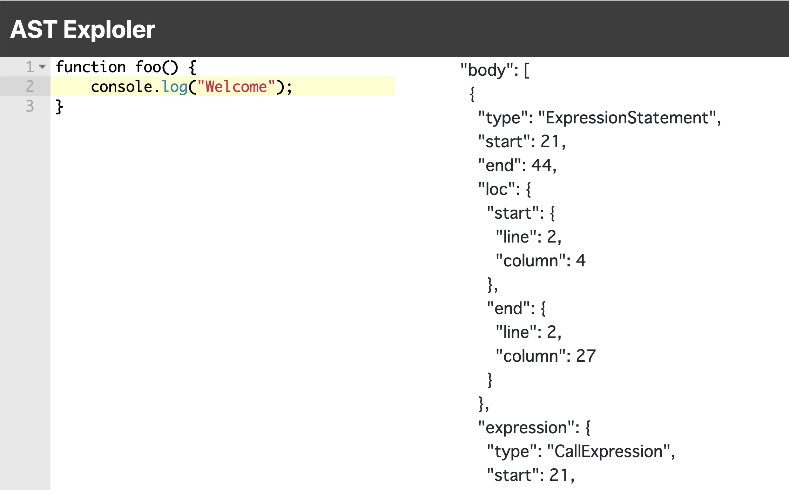

# Prettier AST Explorer

An AST explorer for me.

## Features

-   Works on your browser(does not depends on any server)
-   Rich text editor ([Ace Editor](https://ace.c9.io))
-   Rich JSON Viewer ([json-react-tree](https://www.npmjs.com/package/react-json-tree)).
-   Show [ESTree](https://github.com/estree/estree) from text with [@babel/parser](https://babeljs.io/docs/en/babel-parser) and [@typescript-eslint/typescript-estree](https://github.com/typescript-eslint/typescript-eslint/tree/master/packages/typescript-estree).
    -   via [Prettier](https://prettier.io).
-   Support JavaScript / TypeScript
-   Parse in Web Worker

## TODO

-   [ ] Desktop PWA
-   [ ] Use [vim.wasm](https://github.com/rhysd/vim.wasm)
